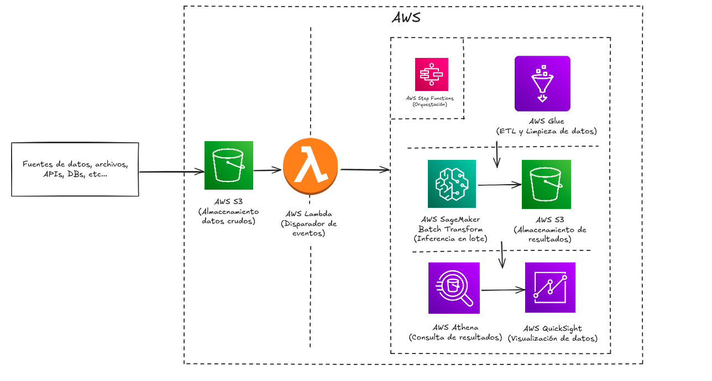
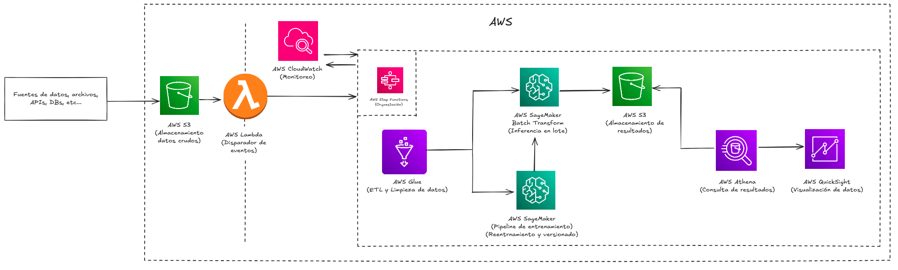

# Prueba Técnica Machine Learning Engineer – GenAI - Nequi

## Propuesta de Arquitectura en la Nube
- Proponga una arquitectura basada en la nube para desplegar un modelo/proceso de NLP en Batch (Utilice preferentemente la nube de AWS). El modelo debe permitir realizar tareas de clasificación o extracción de información a partir de textos.
- Explique cómo la arquitectura facilita escalabilidad y confiabilidad frente a grandes volúmenes de datos.
- Explique la elección de los componentes para la preparación de datos, trabajos ETL, implementación de modelos y su papel en la arquitectura.

### Solución:

#### Arquitectura en AWS:



1. **AWS S3 (Almacenamiento de datos crudos):** Los datos crudos se almacenan en un bucket de S3. Puede ser texto sin procesar o en un formato como JSON, CSV o Parquet.
2. **AWS Lambda (Disparador de eventos):** Actua como disparador que detecta nuevos archivos en el bucket de S3 de datos crudos. Cada vez que se sube un archivo nuevo, Lambda inicia el flujo de trabajo en AWS Step Functions.
3. **AWS Step Functions (Orquestación):** Organiza el flujo de tareas. En este caso coordina las tareas de limpieza en AWS Glue y posteriormente la inferencia en AWS SageMaker Batch Transform.
4. **AWS Glue (ETL y limpieza de datos):** Realiza la transformacion y limpieza en lotes para preparar los datos crudos para la inferencia.
5. **AWS SageMaker Batch Transform (Inferencia en lote):** Para manejar inferencias de gran volumen SageMaker Batch Transform es ideal. Aprovecha instancias potentes y distribuye automaticamente los datos enfragmentos para procesarlos en paralelo, utilizando el modelo previamente entrenado en SageMaker.
6. **AWS S3 (Almacenamiento de resultados):** Los resultados de la inferencia se almacenan en AWS S3. Esto permite acceso rapido para tareas posteriores y almancenamiento eficiente de grandes cantidades de datos inferidos.
7. **AWS Athena (Consulta de resultados):** Con AWS Athena puedes ejecutar consultas sobre los resultados en S3, permitiendo analisis y recuperacion de datos sin necesidad de mover grandes volumenes de datos.
8. **AWS QuickSight (Visualización de datos):** Este servicio se integra con Athena para visualizar datos y generar reportes en tiempo real, facilitando el analisis de grandes volumenes de datos de inferencia de manera visual y accesible.

**Ventajas:**
- Capacidad para grandes volumenes de datos, el uso de SageMaker Batch Transform y Glue permite el procesamiento de grandes lotes de datos de manera distribuida y eficiente.
- Escalabilidad y eficiencia en costos, ya que SageMaker y Glue ofrecen escalabilidad autoamtica ajustando los recursos a la carga de trabajo sin necesidad de gestion manual.
- Optimizacion de recursos al separar las tareas en servicioss especializados, se asegura una utilizacion optima del recurso y un procesamiento mas rapido.
- Visualizacion en tiempo real, lo cual permite analizar los resultados rapidamente, ideal para ajustes o iteraciones rapidas en procesos de NLP.


## Step-by-Step
- Diagrame la secuencia de pasos desde la ingestión de datos hasta el monitoreo y el entrenamiento continuo, incluyendo la orquestación.
- Explique cómo contribuye el componente de orquestación a la ejecución del pipeline de NLP.

### Solución:

#### Diagrama secuencia ingestion-monitoreo-reentrenamiento:



1. **Ingestion de datos:** Los datos crudos se cargan en un bucket de S3.
2. **AWS Lambda (Disparardor de eventos):** Detecta la carga de nuevos archivos en S3 y actua como desencadenador, notificando a AWS Step Functions para iniciar el pipeline de procesamiento.
3. **AWS Step Functions (Orquestación):** 
    -   Coordina las tareas del pipeline. Inicial flujo de trabajo en AWS Glue para limpiar los datos, envia los datos procesados a SageMaker para la inferencia y organiza los pasos de almacenamiento de resultados y monitoreo.
    - Basado en los resultados de la inferencia, la comunicación de monitoreo con CloudWatch es crucial para decidir cuando desencadenar el reentrenamiento del modelo.
4. **AWS Glue (ETL y limpieza de datos):** Los datos crudos se procesan y transforman en AWS Glue. Este paso incluye la limpieza, normalizacion y formateo de los datos en un formato compatible con el modelo de NLP.
5. **AWS SageMaker Batch Transform (Inferencia en Lote):** Con los datos procesados, AWS Step Functions dirige la inferencia en SageMaker Batch Transform, que carga el modelo de NLP entrenado y ejecuta la inferencia en los datos en lote.
6. **Almacenamiento de resultados en AWS S3:** Los resultados de la inferencia se almacenan en S3 para su posterior analisis.
7. **Consulta y visualización de resultados:**
    - AWS Athena permite consultar los datos de inferencia almacenados en S3 para facilitar el analisis.
    - AWS QuickSight visualiza los resultados, generando dashboards e informes que ayudan a identificar patrones o detectar posibles problemas en el rendimiento del modelo.
8. **Monitoreo de desempeño y calidad:**
    - AWS CloudWatch monitorea metricas de rendimiento en cada componente, proporcionando alertas sobre posibles fallos o cambios en la calidad de predicciones.
    - Basado en alertas o condiciones predefinidas, AWS Step Functions puede decidir activar un proceso de reentrenamiento.
9. **Entrenamiento continuo en SageMaker:** Cuando se detectan degradaciones en el rendimiento, Step Functions coordina un flujo de entrenamiento continuo en SageMaker, utilizando nuevos datos etiquetados o muestras recientes de producción. SageMaker actualiza el modelo, y los nuevos modelos se versionan para su uso en el pipeline de inferencia.

**Rol de AWS Step Functions en la orquestación**

AWS Step Functions desempeña un papel crucial en la arquitectura al coordinar y automatizar cada etapa del pipeline de NLP. Sus contribuciones específicas incluyen:

- Coordinación y secuenciación: Define y controla el flujo de trabajo, ejecutando cada tarea en el orden correcto y asegurando que las dependencias entre ellas (por ejemplo, primero limpieza de datos, luego inferencia) se mantengan.
- Manejo de errores y reintentos: En caso de fallos en alguna de las tareas (por ejemplo, en AWS Glue o SageMaker Batch Transform), Step Functions maneja las excepciones y permite reintentos controlados, evitando la necesidad de intervención manual y minimizando el tiempo de inactividad.
- Automatización del entrenamiento continuo: Basando en las métricas monitoreadas (por ejemplo, precisión, latencia) y las alertas de CloudWatch, Step Functions decide si activar un nuevo entrenamiento. Esto permite mantener la precisión del modelo sin intervención manual.
- Escalabilidad y flexibilidad: La naturaleza serverless de Step Functions le permite coordinar múltiples tareas en paralelo o en secuencia, segun la demanda y ajusta automaticamente la capacidad a la carga de trabajo.

### Estructura de Directorios
- Proponga una estructura de directorios para el proyecto que mejore la organización y mantenimiento del código.
- ¿Cómo manejaría la versión del pipeline de preprocesamiento y los modelos entrenados en el directorio de modelos?

### Solución:

#### Estructura de directorios:

```
project_root/
├── README.md                  # Descripción general del proyecto y su configuración
├── requirements.txt           # Dependencias de Python del proyecto
├── src/                       # Código fuente principal
│   ├── __init__.py
│   ├── data_processing/       # Módulos de preprocesamiento de datos
│   │   ├── __init__.py
│   │   ├── preprocess.py      # Funciones principales de preprocesamiento
│   │   ├── tokenizer.py       # Tokenización y otros preprocesamientos
│   │   └── utils.py           # Utilidades para preprocesamiento
│   ├── model/                 # Código relacionado con el modelo de NLP
│   │   ├── __init__.py
│   │   ├── train.py           # Código de entrenamiento del modelo
│   │   ├── evaluate.py        # Evaluación del modelo
│   │   └── utils.py           # Funciones auxiliares del modelo
│   ├── batch_inference/       # Código para inferencia en batch
│   │   ├── __init__.py
│   │   ├── batch_inference.py # Lógica de inferencia en lote
│   │   └── s3_handler.py      # Funciones para manejo de datos en S3
│   └── monitoring/            # Monitoreo y métricas
│       ├── __init__.py
│       └── monitor.py         # Scripts para monitorear la calidad del modelo
├── tests/                     # Pruebas unitarias y de integración
│   ├── test_preprocess.py     # Pruebas para el pipeline de preprocesamiento
│   ├── test_model.py          # Pruebas para el modelo de NLP
│   └── test_inference.py      # Pruebas para la inferencia en batch
├── scripts/                   # Scripts para facilitar tareas específicas
│   ├── download_data.sh       # Script para descargar datos desde S3
│   ├── train_pipeline.sh      # Script para ejecutar el pipeline de entrenamiento
│   └── inference_pipeline.sh  # Script para ejecutar el pipeline de inferencia en lote
└── config/                    # Configuraciones generales del proyecto
    ├── config.yaml            # Configuración global del pipeline y model version
    ├── sagemaker_config.yaml  # Configuración específica para SageMaker
    └── logging_config.yaml    # Configuración de logging
```

1. **Versionado del pipeline de preprocesamiento:**

    Las versiones del pipeline de preprocesamiento se controlan mediante Git. Cada cambio significativo en el preprocesamiento (por ejemplo, nueva tokenización, limpieza de datos) se puede reflejar mediante etiquetas (tags) o ramas en el repositorio de Git.Se recomienda añadir un identificador de versión en el archivo de configuración (config.yaml), para que el pipeline de inferencia pueda registrar la versión de preprocesamiento que se usó en cada inferencia. Esto facilita rastrear versiones en caso de problemas.

2. **MLflow Model Registry:**

    Se puede usar MLflow para gestionar modelos en SageMaker, el Model Registry permite registrar versiones de modelos y sus metadatos en una ubicación centralizada (un bucket de S3 por ejemplo) y referenciarlos sin tener que mover archivos manualmente.Al usar MLflow, solo se necesita almacenar en el repositorio la referencia a la versión del modelo (por ejemplo, mlflow://models/MyModel/version/1).